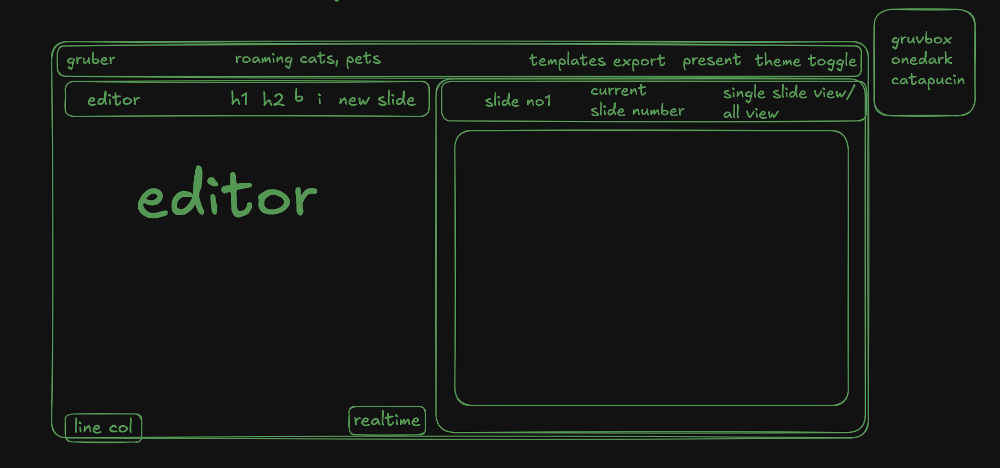
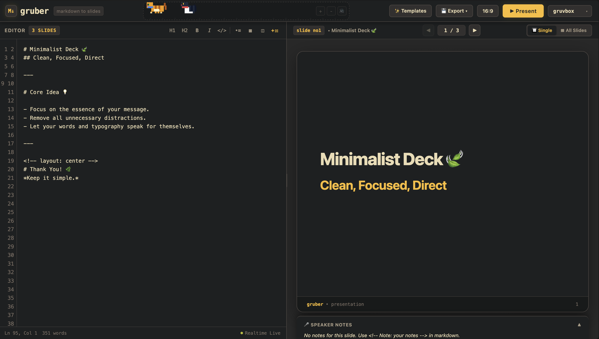

# gruber
made on the name of markdown creator 'John Gruber'

realtime markdown to presentation generator.

## motivation
this project is made for learning purpose and inspired by https://github.com/arpitbbhayani/deckrun, but with a simpler, more focused implementation.here he used parser marked(https://www.npmjs.com/package/marked) which is a markdown parser written in JavaScript but I wanted to learn how tokenizers, parsers, and ASTs work. moreover this project is like you need to have npm installed on your machine, but some non tech people don't know how to use it, so it will be deployed as a static site. Yaa it is not a very big deal to make it a static site, but the project is in itself a learning project.
and for me it is the one of the coolest implementation that i will do myself in this era of Artificial Intelligence.

## inspiration
just look at the wireframe i generated from LLM with this as raw wireframe

and it created it

